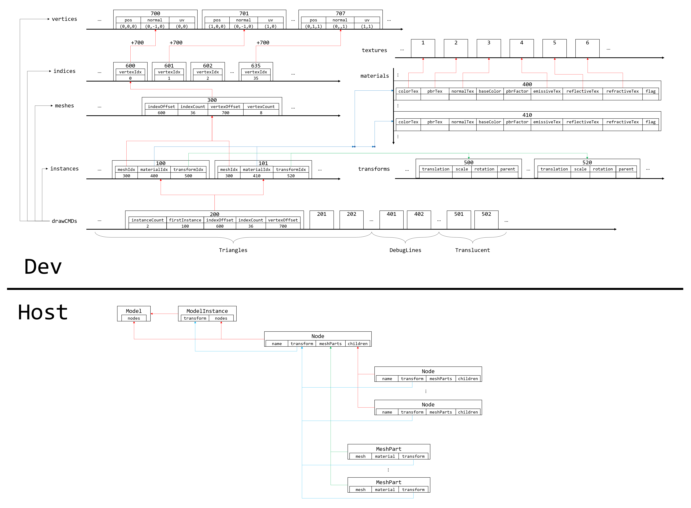
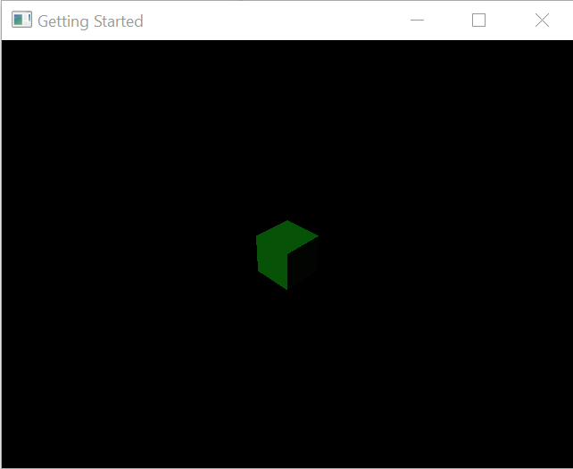
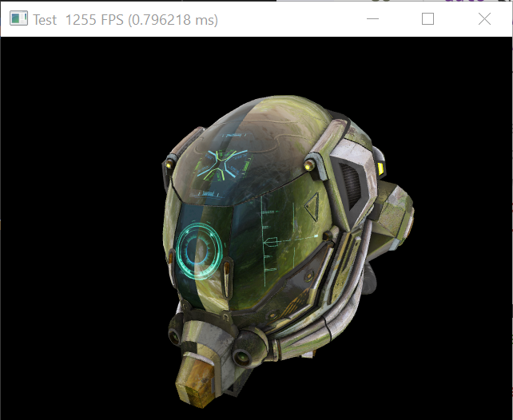
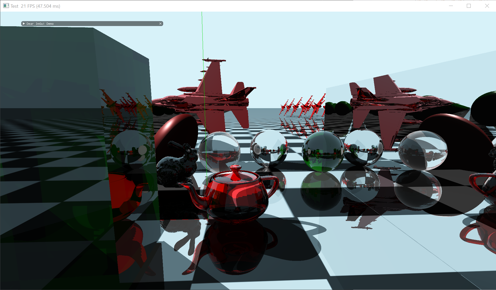
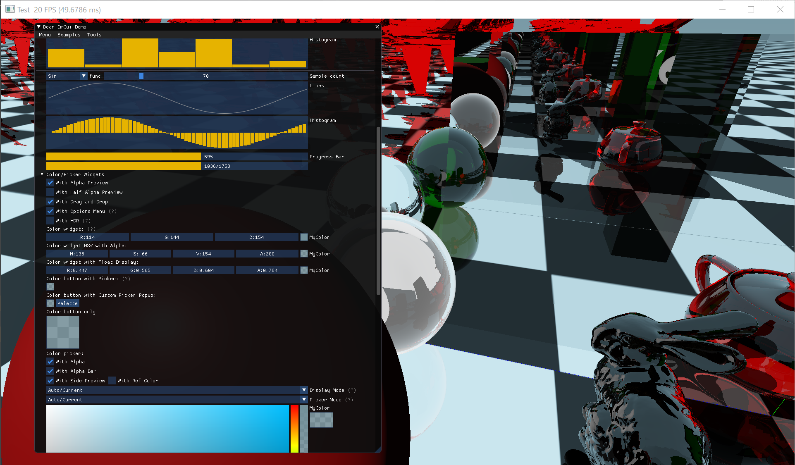

# SimGraphicsNative
 Vulkan based graphics engine written in C/C++.
## Platform Supports

 Platform      | Support   
---------------|-----------
 Windows 10    | True      
 Ubuntu        | True      
 Macos         | False     

## Build

### Prerequisite

Requirements:
* `python3` >= 3.7
* `git` >= 2.0.0
* `gcc` >= 8.1 or `Visual Studio 2017` or above (Windows)
* `cmake` >= 3.14
* `conan` >= 1.19
* Graphics driver that supports `Vulkan 1.1.124`
* RTX 20 series graphics card.

**Ubuntu**:
```shell
sudo apt install -y git gcc cmake make
pip install conan
```

**Windows**:
```shell
Set-ExecutionPolicy RemoteSigned -scope CurrentUser
iwr -useb get.scoop.sh | iex
scoop install python git gcc cmake
pip install conan
```

Add aditional conan repo:
```
conan remote add conan-center https://conan.bintray.com
conan remote add bincrafters https://api.bintray.com/conan/bincrafters/public-conan
conan remote add wumo https://api.bintray.com/conan/wumo/public
```

Build with cmake:
```
mkdir build && cd build
cmake .. -DCMAKE_BUILD_TYPE=Release
cmake --build . --config Release
```

## Architecture



## Getting Started
Draw a green box
```c++
#include "sim/graphics/renderer/deferred/deferred.h"
#include "sim/graphics/model/materials.h"

using namespace sim::graphics;

auto main(int argc, const char **argv) -> int {

  // resolution 1920x1080 and title "Getting..."
  Deferred app{{1920, 1080, "Getting Started"}};

  auto &camera = app.camera();
  camera.location = {10, 10, 10};

  auto &light = app.light(0);
  light.location = {0, 100, 100, 0};

  auto &mm = app.modelManager();
  /**
   * mesh -> shape
   * material -> color/metal/glass, etc.
   * model -> prototype
   * modelInstance -> instance of some prototype
   */
  auto boxMesh = mm.newMeshes([&](MeshBuilder &builder) {
    builder.box({0.0, 0.0, 0.0}, {1.0, 0.0, 0.0}, {0.0, 1.0, 0.0}, 1.0);
  });
  auto greenMaterial = mm.newMaterial(material::Green, PBR{0.3f, 0.4f});
  auto greenBoxModel = mm.newModel(
    [&](ModelBuilder &builder) { builder.addMeshPart(boxMesh[0], greenMaterial); });
  auto greenBox1 = mm.newModelInstance(greenBoxModel);

  // after adding model instances, you have to call app.updateModels() to enable
  // drawing these instances.
  app.updateModels();
  app.run();
}
```
The result is:



## Showcase

Physically based rendering:



RayTracing:



GUI:

